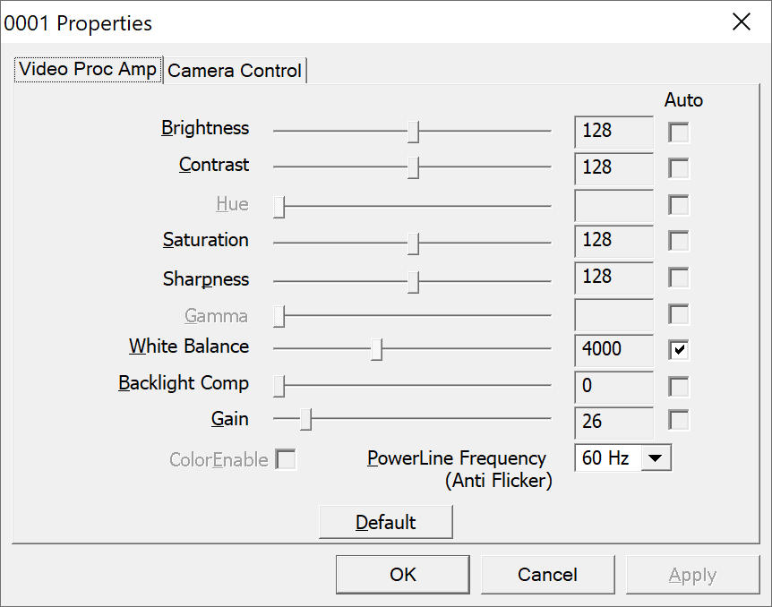
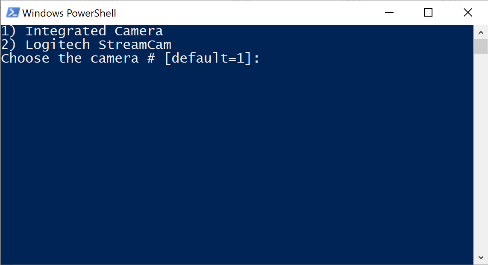

# WindowsCameraProperties

## Usage

Execute `WindowsCameraProperties.ps1` through any of the following methods:

1. Right click -> Run with PowerShell
2. Execute it from the PowerShell CLI

## Troubleshooting

Execute `Set-ExecutionPolicy RemoteSigned` from PowerShell if you see "....ps1 cannot be loaded because running scripts is disabled on this system. ..."
